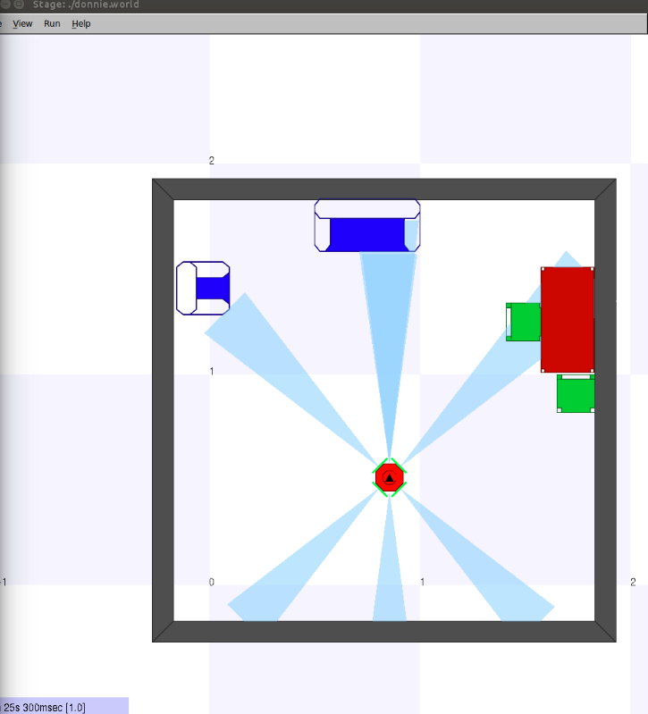
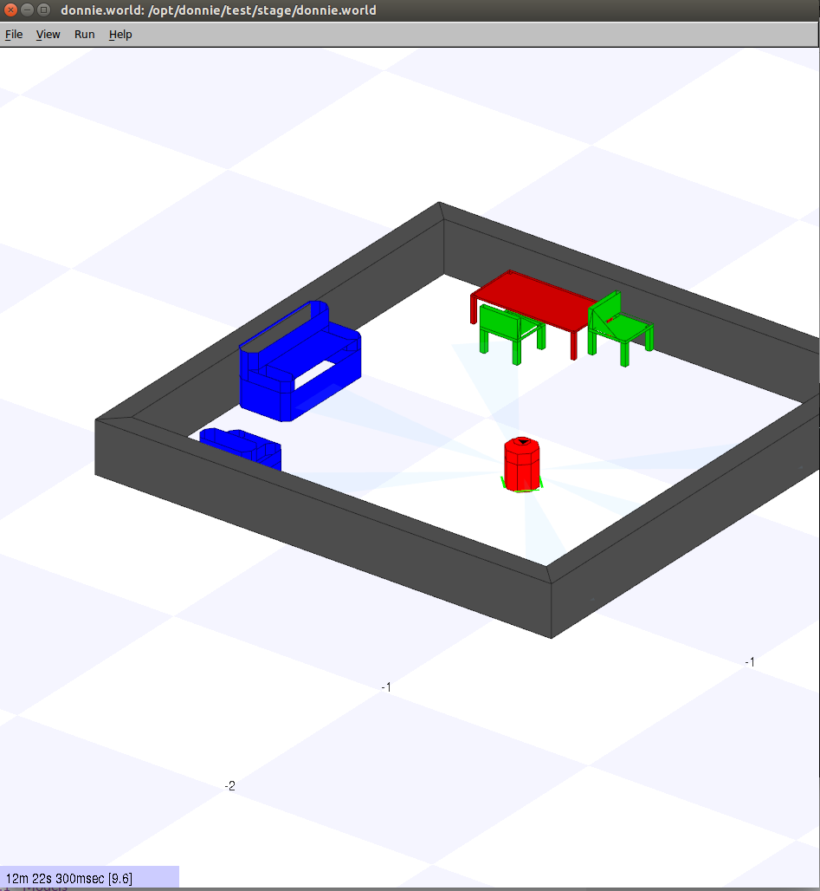

.. _simulation:

===============
Donnie Robot Simulator 
===============

The Donnie Robot Simulator it's a simulator based on Stage that simulates a real environment.
It also simulates a robot called Donnie, which is commanded by a programming language called 
GoDonnie. 

Donnie Scenarios
-------------

.. toctree::
   :maxdepth: 2
   
   stage/basics
   stage/world
   
   
